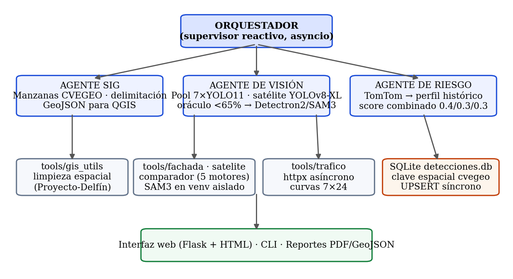
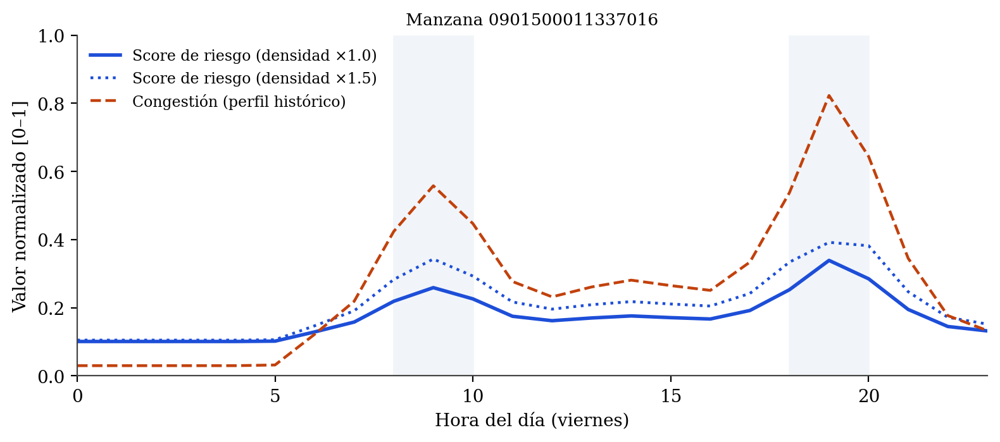

# Plataforma de Análisis Urbano — Sistema Multi-Agente

**Multi-Agent Deep Learning System for Urban Seismic Risk Assessment Integrating Facade, Satellite and Mobility Analytics in Mexico City**

-blue?logo=python&logoColor=white)


Sistema agentivo que consolida cuatro líneas de investigación del Verano Científico
(Programa Delfín) en una plataforma unificada para la **priorización del riesgo urbano
por manzana** en la colonia Hipódromo-Condesa, CDMX: detección de fachadas y daños con
YOLO11, segmentación satelital YOLOv8-XL, comparación multi-modelo de ventanas
(incluida SAM3 zero-shot) y análisis espacial de movilidad.



## Características

| Módulo | Descripción |
|---|---|
| 🗺️ **Centro de mando** | Mapa coroplético de riesgo por manzana (CVEGEO), KPIs globales, distribución de niveles, pipeline multi-agente en un clic, exportación PDF y GeoJSON |
| 🏢 **Análisis de fachadas** | Pool de 7 modelos YOLO11 (fachadas, techos, ventanas, daños, señales, calles) con estimación de pisos por filas de ventanas y daños ponderados por severidad |
| 🔍 **Verificación autónoma** | Si la confianza de ventanas < 65 %, el Agente de Visión contrasta automáticamente con Detectron2 o SAM3 y corrige el conteo |
| 🛰️ **Segmentación satelital** | YOLOv8-XL por mosaicos con traslape configurable (sliders 320–1280 px), área en m², georreferenciación y GeoJSON para QGIS/uMap |
| 🧪 **Laboratorio** | Benchmarking lado a lado de 5 motores de ventanas: YOLOv8, YOLOv8-seg, YOLOv11-seg, Detectron2 y SAM3 (prompt de texto) |
| 📈 **Simulador de crisis** | Proyección del índice de riesgo 24 h al variar día, hora y densidad vial sobre el perfil histórico de congestión |
| 🚦 **Tráfico vial** | TomTom Traffic API asíncrona con *fallback* automático a perfiles históricos 7×24 (el sistema nunca se queda sin señal) |
| 📄 **Catálogo SAM3** | Ingesta idempotente de 3 727 edificios con alturas estimadas por SAM3 al modelo de riesgo (botón «Importar CSV SAM3») |

## Índice de riesgo

```
R = 0.4·min(1, D/10)·c + 0.3·G + 0.3·min(1, P/10)·c ,   c = 1 − e^(−0.5·n)
```

`D` = daños ponderados por severidad (estructural ×1.0, acabados ×0.5, estético ×0.1) ·
`G` = congestión en hora pico · `P` = pisos promedio · `n` = muestras por manzana.
Todos los pesos son configurables en [config/settings.yaml](config/settings.yaml).



## Instalación

> **Requiere [Git LFS](https://git-lfs.com/)** — los pesos (`*.pt`, `*.pth`, ≈1.3 GB)
> se versionan con LFS. Instálalo **antes** de clonar, o corre `git lfs pull` después.

```bash
git lfs install
git clone <URL_DEL_REPOSITORIO>
cd proyecto-urbano-agentivo

bash install.sh          # entorno principal
bash install.sh --todo   # + Detectron2 compilado + venv aislado de SAM3 (Python 3.12 vía uv)
```

**SAM3 (opcional).** El checkpoint `facebook/sam3` es un repositorio *gated* de Hugging
Face: solicita acceso en <https://huggingface.co/facebook/sam3> y autentícate una vez con
`src/tools/env_sam3/bin/huggingface-cli login` (o exporta `HF_TOKEN`). Sin ello, el motor
simplemente se oculta del selector.

**TomTom (opcional).** `export TOMTOM_API_KEY="tu_key"` para congestión en tiempo real;
sin key el sistema usa el perfil histórico automáticamente.

## Uso

```bash
python3 servidor.py                # interfaz web → http://127.0.0.1:3005
python3 main.py --help             # CLI: analizar, riesgo, trafico, manzanas, dashboard
python3 tests/test_flujo_completo.py   # prueba end-to-end (sin GPU, ~5 s)
```

## Estructura

```
├── config/                  # settings.yaml · checkpoints (LFS) · geojson · CSV SAM3 · curvas 7×24
├── database/detecciones.db  # detecciones + tráfico + riesgo, clave espacial CVEGEO
├── docs/                    # reporte formal (DOCX) + figuras
├── src/
│   ├── agents/              # Orquestador · SIG · Visión (oráculo) · Riesgo
│   ├── tools/               # fachada · satelite · comparador (+sam3_worker) · trafico · gis_utils
│   └── dashboard/           # index.html (interfaz) + app.py (Streamlit alterno)
├── servidor.py              # Flask: API + interfaz web
├── main.py                  # CLI multi-agente
└── install.sh               # instalador (incluye venv aislado de SAM3)
```

Los entornos virtuales (`venv/`, `src/tools/env_sam3/`) **no** se versionan — se
recrean con `install.sh`. Nota: los ~1.3 GB de pesos pueden exceder la cuota gratuita
de almacenamiento LFS de GitHub (1 GB); considera GitHub Releases o Hugging Face Hub
para los pesos si aplica.

## Documentación

- 📄 [Reporte técnico formal (DOCX)](docs/Reporte_Sistema_Urbano_Agentivo.docx) — artículo
  completo con metodología, resultados y figuras.
- Detalle de resultados: 100/107 manzanas evaluadas; 1 745 de 3 727 edificios SAM3
  georreferenciados; confianza estadística 98–100 % en el componente de exposición.

## Créditos

Proyecto colaborativo del Verano Científico (Programa Delfín): detección de ventanas
multi-modelo (Ricardo), análisis espacial de movilidad y riesgo sísmico (Evelyn),
detección de fachadas/techos/daños (Mario) y segmentación satelital (Angel — TecNM).
Construido sobre [Ultralytics YOLO](https://github.com/ultralytics/ultralytics),
[Detectron2](https://github.com/facebookresearch/detectron2),
[SAM3](https://github.com/facebookresearch/sam3), TomTom Traffic API, Leaflet/CARTO y
el Marco Geoestadístico del INEGI.

*Licencia: por definir por los autores antes de la publicación del repositorio.*
